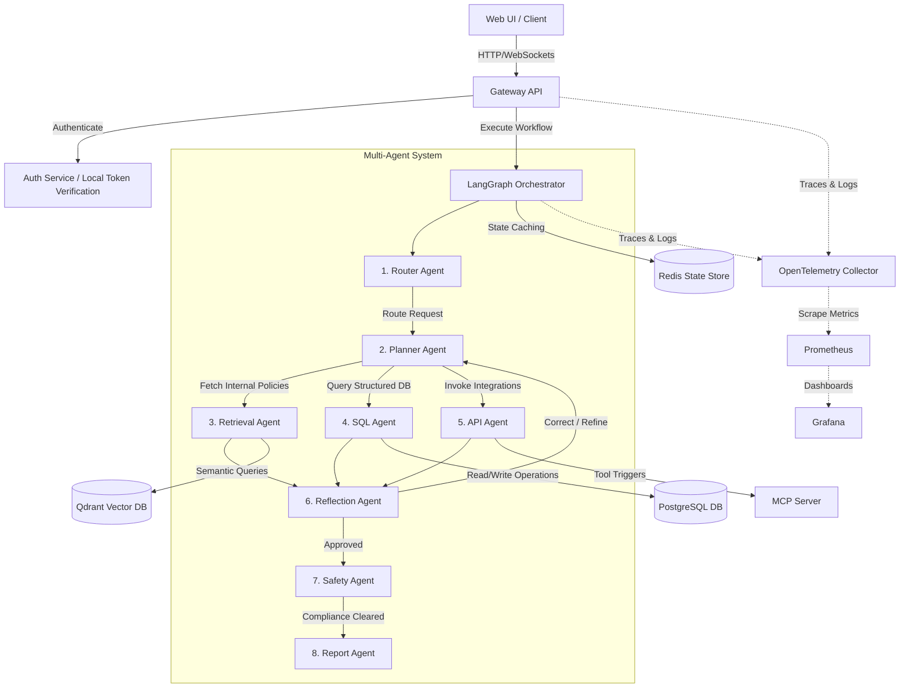

# Darshan's Multi-Agent AI Engineer

### Flagship Enterprise Multi-Agent Operations Platform

[](https://github.com/darshankamate/Enterprise-AI-Operations-Platform/actions)
[](LICENSE)
[](https://www.python.org/)
[](https://nodejs.org/)

An enterprise-grade, stateful, observable multi-agent AI system designed for operational governance, database interaction, retrieval-augmented generation (RAG), and system tool execution. Orchestrated via **LangGraph**, it runs on a decoupled microservices architecture with role-based access control (RBAC), Model Context Protocol (MCP) server integration, and containerized deployment manifests.

Developed by **Darshan Kamate**.

---

## 🏗️ System Architecture

The platform utilizes a modern microservices design. Client actions pass through the API Gateway, are vetted by token security rules, and trigger LangGraph cyclic graphs that coordinate parallel agent actions.



### Core Execution Flow
1. **Routing**: The **Router Agent** filters prompts for injections, applies table-level RBAC filters, and classifies intent.
2. **Planning**: The **Planner Agent** designs a task sequence, revising plans in case of reflection loops.
3. **Execution**: **SQL, Retrieval (RAG), and API Agents** fetch transactional details, semantic chunks, or invoke endpoints via the **MCP Server**.
4. **Reflection**: The **Reflection Agent** audits outputs, triggering plan updates on failures.
5. **Safety**: The **Safety Agent** redacts PII data (emails, cards, hashes) and certifies compliance.
6. **Reporting**: The **Report Agent** compiles final response records.

---

## 🛠️ Technology Stack

- **Backend**: Python 3.11, FastAPI, Uvicorn, Pydantic v2
- **Agent Framework**: LangGraph, LangChain, OpenAI GPT models
- **Vector Search & RAG**: Qdrant, LlamaIndex, Flashrank Reranker
- **Data & Caching**: PostgreSQL, Redis, SQLAlchemy (ORM & Connection Pooling)
- **Tool Integration**: Model Context Protocol (MCP) Server
- **Frontend Dashboard**: React, Vite, TypeScript, Lucide Icons, Vanilla CSS Glassmorphism
- **Observability**: Prometheus, Grafana, OpenTelemetry, LangSmith
- **Deployment**: Docker, Docker Compose, Kubernetes (deployments, service definitions, HPA, ingress routing)
- **CI/CD**: GitHub Actions workflows

---

## 📂 Repository Structure

For details about all folders and modules, refer to the [Folder Structure Manual](docs/Folder_Structure.md).

---

## 🚀 Quick Start & Installation

### 1. Configure Variables
Copy the env template and customize your keys:
```bash
cp .env.example .env
```

### 2. Local Infrastructure
Launch PostgreSQL, Redis, and Qdrant:
```bash
docker compose up postgres redis qdrant -d
```

### 3. Initialize Database Tables & Seed Mock Data
Install python requirements and run seeding:
```bash
pip install -r requirements.txt
python -c "from postgres.service import init_db, seed_db_from_csv; from postgres.database import db_session; init_db(); session=db_session().__enter__(); seed_db_from_csv(session, 'data/database'); session.commit()"
```

### 4. Ingest Documents into RAG
Index corporate policy manuals in Qdrant:
```bash
python scripts/ingest.py
```

### 5. Start Application Microservices
Launch the three backend apps:
```bash
# Terminal 1: MCP Server
python mcp-server/mcp_app.py

# Terminal 2: RAG Service
export API_PORT=8001
python rag-service/main.py

# Terminal 3: API Gateway
python gateway-api/main.py
```

### 6. Start React Client
Build and run the Vite dashboard:
```bash
cd frontend
npm install
npm run dev
```
Open `http://localhost:5173` to access the Control Panel.

---

## 🐳 Containerization & Production Deployments

For multi-container or Kubernetes scaling configurations, refer to the [Deployment Runbook](docs/Deployment_Guide.md).

### Docker Compose
Run the entire platform using a single command:
```bash
docker compose up --build -d
```

### Kubernetes Deployments
Deploy components into a cluster:
```bash
kubectl apply -f kubernetes/namespace.yaml
kubectl apply -f kubernetes/secrets.yaml
kubectl apply -f kubernetes/postgres-statefulset.yaml
kubectl apply -f kubernetes/qdrant-statefulset.yaml
kubectl apply -f kubernetes/redis-deployment.yaml
kubectl apply -f kubernetes/mcp-server-deployment.yaml
kubectl apply -f kubernetes/rag-service-deployment.yaml
kubectl apply -f kubernetes/gateway-api-deployment.yaml
kubectl apply -f kubernetes/frontend-deployment.yaml
kubectl apply -f kubernetes/ingress.yaml
```

---

## 📋 API & Agents Manuals

- Detail specifications of endpoints: [API Specifications](docs/API_Documentation.md).
- Details of specialized Agent nodes: [Agent Architecture](docs/Agent_Architecture.md).
- Setup guides: [Developer Guide](docs/Developer_Guide.md).
- Interactive all-in-one HTML guide: [Platform Reference Manual](docs/platform_overview.html).

---

## 🔬 Observability & Test Validation

- **Observability**: Prometheus metrics are exposed at `/metrics`, collecting token usages, costs, and latencies. Live charts are plotted in Grafana dashboards. Detailed LLM node runs are tracked inside LangSmith.
- **Tests Validation**: Automated verification is run via `pytest`. Verify code quality with:
  ```bash
  pytest -v
  ```

---

## 🔮 Future Improvements

1. **Kubernetes TLS Setup**: Inject cert-manager TLS certificates inside the Ingress resource for end-to-end encryption.
2. **Distributed Checkpointing**: Migrate from local memory savers to clustered Redis DB instances.
3. **Advanced Semantic Cache**: Cache user requests inside Qdrant to bypass LLM calls on repeat queries, reducing costs.

---

## 📄 License

Distributed under the MIT License. See [LICENSE](LICENSE) for more details.

---

## 👨‍💻 Author

**Darshan Kamate**  
*Principal AI Engineer & Software Architect*  
*Email: darshan.kamate@Darshan_AI_Engineer_Ops-solutions.com*
