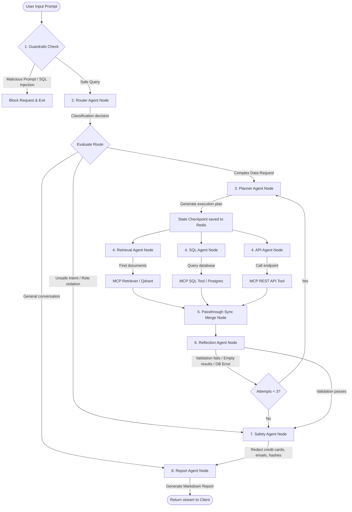

# bia's Multi-Agent AI Engineer

### Flagship Enterprise Multi-Agent Operations Platform

[](https://github.com/darshankamate/Enterprise-AI-Operations-Platform/actions)
[](LICENSE)
[](https://www.python.org/)
[](https://nodejs.org/)

An enterprise-grade, stateful, observable multi-agent AI system designed for operational governance, database interaction, retrieval-augmented generation (RAG), and system tool execution. Orchestrated via **LangGraph**, it runs on a decoupled microservices architecture with role-based access control (RBAC), Model Context Protocol (MCP) server integration, and containerized deployment manifests.

Developed by **Darshan Kamate** (*Principal AI Engineer & Software Architect*).

---

## 🏗️ 1. Platform & Microservice Architecture

The platform utilizes a modern decoupled microservices design. Client actions pass through the API Gateway, are vetted by token security rules, and trigger LangGraph cyclic graphs that coordinate parallel agent actions.

### System Components & Communications Blueprint
```mermaid
graph TD
    classDef client fill:#3b82f6,stroke:#1d4ed8,stroke-width:2px,color:#fff;
    classDef gateway fill:#8b5cf6,stroke:#6d28d9,stroke-width:2px,color:#fff;
    classDef agent fill:#10b981,stroke:#047857,stroke-width:2px,color:#fff;
    classDef mcp fill:#f59e0b,stroke:#d97706,stroke-width:2px,color:#fff;
    classDef storage fill:#ec4899,stroke:#be185d,stroke-width:2px,color:#fff;
    classDef monitoring fill:#64748b,stroke:#475569,stroke-width:2px,color:#fff;

    Client[React Frontend Dashboard<br>Vite | TS | Glassmorphism]:::client -->|HTTPS / SSE| GW[FastAPI Gateway API<br>JWT & RBAC Filters]:::gateway
    
    GW -->|Validate Token| Auth[Auth Service<br>Local Authentication]:::gateway
    GW -->|Orchestrate workflow| LG[LangGraph Orchestrator<br>StateGraph Execution]:::gateway
    
    subgraph Multi-Agent Grid
        LG --> Agents[Specialized Agent Nodes<br>Router, Planner, Workers, Safety...]:::agent
    end
    
    Agents -->|Invoke Tools via HTTP| MCP[MCP Server<br>Model Context Protocol]:::mcp
    
    MCP -->|Read / Write SQL| Postgres[(PostgreSQL DB<br>Transactional Stores)]:::storage
    MCP -->|Read / Write Files| FS[Sandboxed Filesystem]:::mcp
    MCP -->|HTTP Requests| ExternalAPI[External Rest APIs]:::mcp
    
    Agents -->|Semantic Query| RAG[RAG Service API<br>Similarity & Flashrank Rerank]:::agent
    RAG -->|Vector Search| Qdrant[(Qdrant Vector DB<br>Embeddings Stores)]:::storage
    
    LG -->|Checkpointer State| Redis[(Redis State Store<br>Session Checkpoints)]:::storage
    
    %% Telemetry Paths
    GW -.->|Logs & Traces| OTEL[OpenTelemetry Collector]:::monitoring
    LG -.->|Logs & Traces| OTEL:::monitoring
    OTEL -.->|Scrape Metrics| Prom[Prometheus Engine]:::monitoring
    Prom -.->|Live Dashboards| Grafana[Grafana Dashboard]:::monitoring
```

### Component Taxonomy

| Service / Layer | Default Port | Primary Responsibility | Key Technologies |
| :--- | :--- | :--- | :--- |
| **Client Frontend** | `5173` (Dev) / `3000` (Prod Nginx) | Interactivity dashboard including agent execution streams, RAG document uploading, schema inspector, and Ragas metrics dashboard. | React, Vite, TS, Vanilla CSS Glassmorphism |
| **API Gateway** | `8000` | Orchestrates LangGraph execution, processes JWT user log-ins, enforces role routing rules, and streams workflow outputs via Server-Sent Events (SSE). | FastAPI, Uvicorn, LangGraph, PyJWT |
| **RAG Service** | `8001` | Handles document upload parser loading, character chunking, vector indexing in Qdrant, and hybrid reranking retrieval. | FastAPI, LlamaIndex, LangChain, Flashrank |
| **MCP Server** | `8080` | Unified tool provider implementing the Model Context Protocol (MCP) to run SQL queries, vector searches, filesystem checks, math, and network requests. | Python MCP SDK, Requests, AST evaluator |
| **PostgreSQL** | `5432` | Relational transactional database storing operational tables (`employees`, `orders`, `inventory`, `users`, etc.). | PostgreSQL 15, SQLAlchemy, DB Seeder |
| **Qdrant** | `6333` | Vector database storing document embeddings and executing fast similarity search indexing. | Qdrant DB, OpenAI `text-embedding-3-small` |
| **Redis** | `6379` | State persistence engine storing active LangGraph memory checkpoints across user sessions. | Redis DB, `redis-py` checkpointer |

---

## 🤖 2. Multi-Agent System & Orchestration

The graph is orchestrated using a stateful **LangGraph** workflow. Execution uses conditional routing and parallel branches to speed up response times.

### Dynamic Agent Execution & Coordination Flow


### Agent Nodes Registry

| Agent Name | Primary Responsibility | Input State | Output Format | Associated MCP Tools |
| :--- | :--- | :--- | :--- | :--- |
| **Router** | Classify request intent, scan for prompt injection, and verify table/action permission access. | `user_query`, `role` | `RouteDecision` | *None (Security Guardrails)* |
| **Planner** | Split complex queries into sequential tasks. Compiles message summaries if thread history exceeds 6 records. | `user_query`, `reflection_feedback` | `PlanSteps` | *None* |
| **Retrieval (RAG)** | Pull related policy guide text matches from the vector database. | `user_query`, `route` | `retrieved_context` | `retriever` |
| **SQL** | Construct and execute read-only queries against permitted database tables. | `user_query` | `sql_query`, `sql_result` | `sql_query` |
| **API** | Dispatch REST actions to fetch integration or system endpoint statuses. | `user_query` | `api_payload`, `api_result` | `rest_api` |
| **Reflection** | Verify responses. Loop execution back to the Planner if database errors or missing contexts occur (Max 3 retries). | `sql_result`, `retrieved_context` | `ReflectionVerdict` | *None* |
| **Safety** | Scan output responses for sensitive PII parameters and mask matches. | `sql_result`, `retrieved_context` | `SafetyVerdict` | *None (Security Library)* |
| **Report** | Structure accumulated outputs into a clean markdown document or table. | `sql_result`, `retrieved_context` | `final_report` | *None* |

---

## 📚 3. RAG Ingestion & Retrieval Pipeline

The Retrieval-Augmented Generation pipeline handles importing markdown documents, chunking content, generating embeddings, and executing similarity retrievals.

### Ingestion & Retrieval Workflow
```mermaid
flowchart TD
    subgraph Document Ingestion Pipeline (Admin/Manager Roles)
        Upload([Upload Markdown File]) --> AuthVerify{RBAC Auth Check}
        AuthVerify -->|Deny| ErrorResp[Access Denied Response]
        AuthVerify -->|Allow| IngestAPI[RAG Ingestion API]
        IngestAPI --> Loader[loader.py: Read markdown contents]
        Loader --> Chunker[chunker.py: Recursive Character Text Splitter]
        Chunker --> Embedding[OpenAI text-embedding-3-small]
        Embedding --> VectorStore[vector_store.py: Bulk upload to Qdrant]
        VectorStore --> Indexed[(Qdrant Vector Database)]
    end

    subgraph Document Retrieval Pipeline
        Query([User Query Context]) --> RAG_API[RAG Service API]
        RAG_API --> Retrieve[retriever.py: Similarity search in Qdrant]
        Indexed -.-> Retrieve
        Retrieve --> Rerank[Flashrank Local Reranker]
        Rerank --> ContextMatch[Top-N context paragraphs matching query]
    end
```

- **Chunking Strategy**: Employs LangChain's `RecursiveCharacterTextSplitter` with chunk sizes of 1000 characters and 150-character overlap bounds.
- **Reranker Model**: Flashrank's `ms-marco-MiniLM-L-6-v2` reranks initial vector results to filter out irrelevant contexts and optimize token usage.

---

## 🔬 4. RAG Evaluation Center (Ragas)

To monitor and maintain response quality, the system includes an automated evaluation suite using **Ragas** metrics:

*   **Faithfulness**: Assesses whether the generated response is factual and grounded strictly in the retrieved context.
*   **Answer Relevancy**: Measures how directly the generated answer addresses the initial user query.
*   **Context Precision**: Evaluates whether the retrieved context contains relevant information at the top of the search results.
*   **Context Recall**: Calculates the alignment between the retrieved contexts and the ground-truth reference document answers.

### Execution Modes

The evaluation runner (`tests/test_rag_evaluation.py`) features two operation modes:
1.  **Live Mode**: Triggered when a valid `OPENAI_API_KEY` is present. It uses LangChain's OpenAI integrations to run LLM-based evaluation metrics.
2.  **Simulated Mode (Fallback)**: Automatically runs when no valid OpenAI API key or internet access is detected. It uses local token and text-similarity calculations to verify answers, marking the dashboard report with a warning badge.

### Triggering Evaluations

*   **Command Line (CLI)**:
    ```bash
    pytest tests/test_rag_evaluation.py -v
    ```
*   **Gateway REST API**:
    ```bash
    curl -X POST http://localhost:8000/run-evaluation
    ```
*   **Vite Dashboard**: Navigate to the **Evaluation Center** tab in the browser dashboard to trigger executions and view live glassmorphic charts of Ragas metrics stored in `evaluation_report.json` / `evaluation_report.html`.

---

## 🛡️ 5. Observability, Security & Compliance Guardrails

Security is enforced at every layer of the platform using active scanners, role-based configurations, and validation hooks:

| Guardrail Layer | Checked By | Action Taken on Match |
| :--- | :--- | :--- |
| **Prompt Injection** | Router Node / Regex Library | Immediately intercepts processing, skips LLM execution, routes to Safety/Report, and alerts the client. |
| **RBAC Security** | Gateway Middleware / Router | Validates user JWT tokens. Restricts access by user role (e.g. locks RAG uploads to `Admin`/`Manager` roles; prevents `User` roles from querying tables like `users` or sensitive columns like `salary`). |
| **SQL SQL Isolation** | SQL Agent / MCP Server | Parses queries to ensure they strictly contain read-only `SELECT` statements. Blocks write operations like `INSERT`, `UPDATE`, `DELETE`, or `DROP`. |
| **PII Redaction** | Safety Node / Security Library | Scans responses using regular expressions to redact credit cards, email addresses, and password hashes, replacing them with placeholders like `[REDACTED_EMAIL]`. |

---

## 📂 6. Repository Structure

Refer to the [Folder Structure Manual](docs/Folder_Structure.md) for a detailed file-by-file directory overview.

---

## 🚀 7. Step-by-Step Local Developer Setup Guide

### 1. Configure Variables
Copy the env template to the project root and add your configuration details:
```bash
cp .env.example .env
```

### 2. Launch Local Infrastructure
Start PostgreSQL, Redis, and Qdrant in detached mode using Docker Compose:
```bash
docker compose up postgres redis qdrant -d
```

### 3. Initialize Databases & Seed Relational Tables
Install python requirements, initialize database tables, and import CSV mock datasets:
```bash
pip install -r requirements.txt
python -c "from postgres.service import init_db, seed_db_from_csv; from postgres.database import db_session; init_db(); session=db_session().__enter__(); seed_db_from_csv(session, 'data/database'); session.commit()"
```
*Seeded files cover `customers`, `departments`, `employees`, `inventory`, `orders`, `products`, `support_tickets`, and `users` CSV records.*

### 4. Index Corporate Manuals into RAG
Upload and embed markdown policy guides into Qdrant:
```bash
python scripts/ingest.py
```

### 5. Run Application Microservices
Open three separate terminal windows and run the python processes:
*   **Terminal 1: Model Context Protocol (MCP) Server**
    ```bash
    python mcp-server/mcp_app.py
    ```
*   **Terminal 2: Retrieval-Augmented Generation (RAG) Service**
    ```bash
    # Windows PowerShell
    $env:API_PORT="8001"
    python rag-service/main.py

    # Linux / macOS / Windows Git Bash
    export API_PORT=8001
    python rag-service/main.py
    ```
*   **Terminal 3: API Gateway & Orchestrator**
    ```bash
    python gateway-api/main.py
    ```

### 6. Start the React Frontend Dashboard
Navigate to the client folder, install node dependencies, and boot Vite's dev server:
```bash
cd frontend
npm install
npm run dev
```
Open `http://localhost:5173` to access the Control Panel.

### 7. Run Test Suites
Verify all microservices, agents, and security libraries are healthy:
```bash
pytest -v
```

---

## 🐳 8. Production Docker & Kubernetes Scaling

### Single-Command Production Start (Docker Compose)
To run all applications, caching layers, and database engines in containerized mode:
```bash
docker compose up --build -d
```
The services will be exposed at:
- **Client Frontend UI**: `http://localhost:3000` (Nginx mapping container port `80`)
- **API Gateway**: `http://localhost:8000`
- **RAG Service**: `http://localhost:8001`
- **MCP Server**: `http://localhost:8080`
- **Prometheus UI**: `http://localhost:9090`
- **Grafana Panels**: `http://localhost:3000` *(Internal: `3000:3000`)*

### Kubernetes Cluster Deployment
To scale microservices across a cluster, execute the following commands sequentially:

```bash
# 1. Create system namespace and configure credentials
kubectl apply -f kubernetes/namespace.yaml
kubectl apply -f kubernetes/secrets.yaml

# 2. Deploy stateful database stores with PersistentVolumeClaims
kubectl apply -f kubernetes/postgres-statefulset.yaml
kubectl apply -f kubernetes/qdrant-statefulset.yaml
kubectl apply -f kubernetes/redis-deployment.yaml

# 3. Deploy platform microservices
kubectl apply -f kubernetes/mcp-server-deployment.yaml
kubectl apply -f kubernetes/rag-service-deployment.yaml
kubectl apply -f kubernetes/gateway-api-deployment.yaml
kubectl apply -f kubernetes/frontend-deployment.yaml

# 4. Bind ingress routes
kubectl apply -f kubernetes/ingress.yaml
```

To monitor auto-scaling groups:
```bash
kubectl get hpa gateway-api-hpa -n enterprise-ai-platform
```

---

## 📄 License

Distributed under the MIT License. See [LICENSE](LICENSE) for more details.

