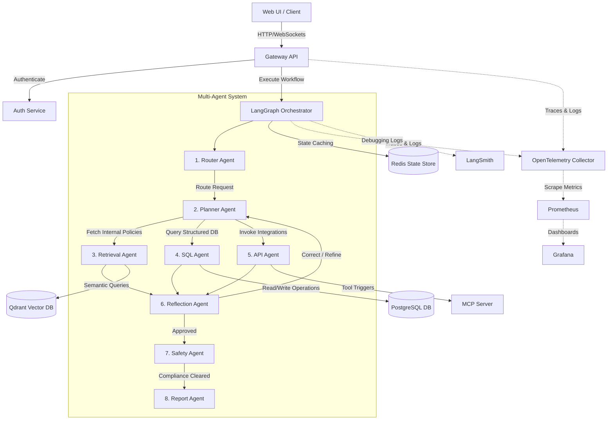

# Enterprise AI Operations Platform

The **Enterprise AI Operations Platform** is a production-grade, observable multi-agent system designed for automated operational governance, retrieval-augmented intelligence, structured query execution, and external tool integration. 

Built on a robust microservices architecture, the platform uses **LangGraph** to coordinate specialized agents, ensuring absolute safety, accuracy, and predictability in runtime execution.

---

## 🏗️ Architecture Overview

The system operates via a decoupled microservices design: client requests flow through an API Gateway, are validated by an Authentication service, and trigger stateful multi-agent execution graphs orchestrated by LangGraph.



### Core Execution Flow
1. **Routing**: The **Router Agent** analyzes incoming requests to classify intent and direct them to the appropriate subgraph.
2. **Planning**: The **Planner Agent** breaks down complex operations into sequential goals (SQL queries, vector searches, API calls).
3. **Execution**: **SQL, Retrieval (RAG), and API Agents** execute tasks asynchronously using context-specific tools.
4. **Reflection**: The **Reflection Agent** evaluates intermediate outputs, verifying database formats and RAG relevancy, prompting revisions if necessary.
5. **Safety**: The **Safety Agent** scans outputs for compliance, PII leaks, and hallucination bounds before reporting.
6. **Reporting**: The **Report Agent** compiles final answers, tables, or alerts and feeds them back to the client interface.

---

## 🛠️ Technology Stack & Justification

| Technology | Role | Justification |
| :--- | :--- | :--- |
| **Python** | Runtime Language | Industry standard for machine learning, data engineering, and agent systems. |
| **FastAPI** | REST API Layer | High-performance, async-native web framework with automatic OpenAPI documentation. |
| **LangGraph** | Multi-Agent Orchestration | State-of-the-art framework for cyclic, stateful graphs; crucial for agent loops and reflection. |
| **LangChain** | LLM Abstractions | Streamlines prompt engineering, model switching (OpenAI / Anthropic), and chain execution. |
| **PostgreSQL** | Relational Storage | Handles structured enterprise data (orders, employees, tickets) with strong ACID guarantees. |
| **Redis** | State Cache & Sessions | In-memory key-value store for session persistence and LangGraph checkpointers. |
| **Qdrant** | Vector Search Engine | High-performance vector database supporting hybrid semantic searches and metadata filters. |
| **Model Context Protocol (MCP)** | Tool Layer | Standardizes tool definitions, enabling agents to securely execute commands on remote servers. |
| **LangSmith** | LLM Tracing & Debugging | Essential for tracing agentic decisions, prompt versioning, and latency analysis. |
| **Prometheus & Grafana** | Metrics & Visualization | Monitors system health, request counts, error rates, and custom token-consumption metrics. |
| **Docker & Kubernetes** | Orchestration | Simplifies local development configurations and production-scale cloud deployments. |

---

## 📁 Repository Structure

```
enterprise-ai-platform/
├── auth-service/         # Authentication & Authorization Service (OIDC, JWT, RBAC)
├── config/               # Platform-wide Configuration Management
│   ├── __init__.py
│   └── settings.py       # Pydantic Settings environment configuration loader
├── data/                 # Platform Datasets
│   ├── database/         # PostgreSQL schema.sql, seed.sql, and relational CSVs
│   └── documents/        # Fictional enterprise corpus (HR, IT, Sales, Support policies)
├── docker/               # Service-specific Dockerfiles and setup manifests
├── docker-compose.yml    # Root multi-service local container orchestrator
├── docs/                 # Architectural manuals and development guides
├── frontend/             # User Interfaces (Admin console, Chat dashboard)
├── gateway-api/          # API Gateway for request routing and rate-limiting
├── kubernetes/           # Kubernetes manifests and deployment charts
├── langgraph/            # Core state machine engine definition
├── mcp-server/           # Model Context Protocol hosting local tools
├── monitoring/           # Observability Stack configs
│   ├── grafana/
│   ├── prometheus/       # Prometheus scraper configurations (prometheus.yml)
│   └── telemetry/        # OpenTelemetry tracing scripts
├── prompts/              # Centralized prompt templates for each of the 8 agents
├── qdrant/               # Qdrant schema definitions and collection setup
├── postgres/             # Database initialization settings
├── redis/                # Caching setup scripts
├── requirements.txt      # Production dependencies
├── rag-service/          # Document chunking, embedding, and semantic search API
├── scripts/              # Data generation, indexing, and deployment scripts
├── tests/                # System test suites (Unit, Integration, E2E)
├── tools/                # Specialized python tools for the 8 agent executors
└── README.md             # Platform Documentation (this file)
```

---

## 🗺️ Development Roadmap

Our incremental implementation roadmap covers six distinct phases:

### Phase 1: Project Initialization 📍 (Current)
- [x] Configure standard folder structure and base directories.
- [x] Generate requirements, environment variables template, and configuration settings.
- [x] Write `docker-compose.yml` to spin up PostgreSQL, Redis, Qdrant, and Grafana.
- [x] Initialize the fictional enterprise policies and database records.

### Phase 2: Core Infrastructure & Ingestion
- [ ] Spin up container databases and perform schema initialization.
- [ ] Set up ingestion scripts to chunk and embed corporate documents into Qdrant collections.
- [ ] Implement the FastAPI Gateway and user authentication flow.

### Phase 3: Agent Implementation
- [ ] Code the 8 specialized agents with Pydantic inputs and outputs.
- [ ] Bind tools to SQL, Retrieval, and API agents using MCP.
- [ ] Formulate prompt templates with safety checks and system boundaries.

### Phase 4: State Machine Orchestration
- [ ] Connect the 8 agents using a stateful LangGraph `StateGraph`.
- [ ] Set up memory checkpointers in Redis for context conservation.
- [ ] Set up cyclic routing rules (Reflection -> Planner loop).

### Phase 5: Monitoring & Optimization
- [ ] Instrument services with OpenTelemetry metrics and traces.
- [ ] Configure Prometheus scrapers and build Grafana dashboards.
- [ ] Connect LangSmith for LLM output tracing and token budget metrics.

### Phase 6: Final Validation & Deployment
- [ ] Run E2E automation tests covering complex user intents.
- [ ] Generate Helm charts for Kubernetes cluster deployment.
- [ ] Deploy platform frontend and perform demo validation.

---

## ⚡ Quick Start

### Prerequisites
- Python 3.10+
- Docker & Docker Compose

### 1. Set Up Environment Settings
Copy the environment variables template and configure your secrets:
```bash
cp .env.example .env
```

### 2. Launch Infrastructure Services
Spin up PostgreSQL, Redis, Qdrant, Prometheus, and Grafana:
```bash
docker compose up -d
```

### 3. Initialize Python Environment
Install the platform dependencies:
```bash
pip install -r requirements.txt
```
