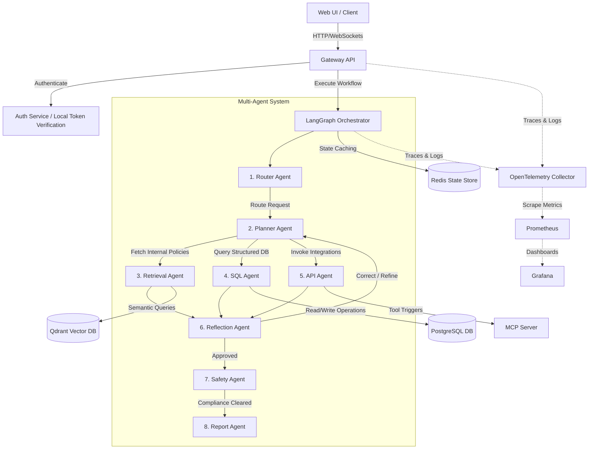

# Platform Architecture

This document describes the architectural layout of **Darshan's Multi-Agent AI Operations Platform**.

The platform is designed around a decoupled, microservices-first architecture to ensure scalability, fault isolation, and independent deployment of the frontend client, API Gateway, RAG pipeline, and Model Context Protocol (MCP) server.

---

## System Architecture Blueprint

The client request enters the API Gateway, which handles security token checks and delegates stateful execution graphs using LangGraph.

---

## Component Taxonomy

### 1. Client Frontend (React Dashboard)
A single-page React client served by Nginx. Provides access to:
- A live chat interface showing agent updates.
- Ingestion interfaces for corporate manuals.
- Database schema inspection.
- Observability and latency metrics gauges.

### 2. API Gateway (`gateway-api`)
The main entry point for client HTTP traffic, built with FastAPI. It handles:
- **Authentication (JWT & RBAC)**: Verifies user tokens and restricts route privileges (e.g., locking ingestion routes to Admins/Managers).
- **LangGraph Coordination**: Instantiates the StateGraph and streams intermediate state updates to the client via Server-Sent Events (SSE).
- **Distributed Caching**: Backs LangGraph memory checkpointing with Redis.

### 3. Model Context Protocol (MCP) Server (`mcp-server`)
Standardizes tool integrations. Instead of executing commands directly, agents send tool-calling requests to the MCP server. Exposes tools for:
- Database SELECT execution.
- Vector policy retrievals.
- Ast-based calculations.
- Sandboxed file reads/writes.
- HTTP client requests.

### 4. RAG Service (`rag-service`)
Processes document loading and vector index uploads. Handles:
- **Chunking**: Uses LangChain's `RecursiveCharacterTextSplitter`.
- **Embeddings**: Uses OpenAI's `text-embedding-3-small`.
- **Hybrid Retriever**: Similarity vector retrieval inside Qdrant and local reranking via Flashrank.

### 5. Datastore Layer
- **PostgreSQL**: Stores relational, transactional enterprise tables.
- **Qdrant**: Stores embedded text chunks of corporate policy guides.
- **Redis**: Caches LangGraph checkpointing states for session memory preservation.
